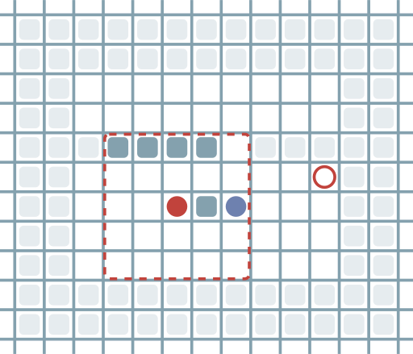

# SRSLM

| RePlan | AORePlan |
|:---:|:---:|
|  |  |

Reference implementation for **SRSLM: Switch and Reweight with Shared Trace
Memory for Lifelong Partially Observable Multi-Agent Pathfinding**.

## Current method

The public implementation contains the proposed method, its planning baseline,
and the ablations needed to inspect each component:

- **RePlan** is the original dynamic replanning baseline.
- **AORePlan** changes only a reverse move. It queries A* once on the static
  map and uses a usable non-reverse first step; a missing or locally
  conflicting static step becomes wait. The previous position is recorded at
  every timestep, including waits and blocked moves. RePlan's original
  BestMove and 50% random / 50% stay no-path fallback are otherwise preserved.
- **EPOM-L** is the lifelong fine-tuned recurrent base policy used by CAAR.
- **Direct** subtracts a fixed capped-ReLU pressure, computed from the shared
  11x11 trace, from the five base-policy logits.
- **CAAR** freezes EPOM-L and trains a separate trace branch. A Conv32 encoder
  with two residual blocks maps the mean-centred 11x11 trace to 32 features.
  These features are fused with the frozen 512-dimensional recurrent state and
  five base logits. The branch outputs five logit corrections. A policy-entropy
  gate decides whether to apply them; no action mask is an input to the learned
  branch. CAAR has 303,846 trainable parameters.
- **Switcher** is a feed-forward PPO policy with two outputs: choose CAAR or
  choose AORePlan. It does not output a primitive grid action.
- **SRSLM** uses CAAR immediately when AORePlan proposes wait. For every
  non-wait AORePlan proposal, Switcher samples one of the two complete
  candidate actions. Training and evaluation share the same routing code.

Historical value-estimator switchers and experimental compatibility branches
are not part of this source release.

## Installation

Python 3.10 or 3.11 and a C++ compiler are required. `cppimport` builds the
planner extension from `planning/planner.cpp` when it is first imported.

```bash
git clone https://github.com/CQSWU/SRSLM.git
cd SRSLM
uv sync --extra test
```

## Quick AORePlan check

AORePlan has no learned parameters:

```bash
uv run python run_experiments.py \
  --algorithms AORePlan \
  --map-file maps/srlsm_smoke.map \
  --agents 16 --seeds 0 --workers 1 \
  --obs-radius 5 --max-steps 128 \
  --on-target restart --collision-system block_both \
  --output-dir results --output aoreplan_smoke.json
```

## Training sequence

The current learned pipeline has three stages. Checkpoints are deliberately not
committed to Git, and each later stage requires the earlier checkpoint at the
path recorded in its YAML file.

```bash
# 1. Lifelong fine-tune of the EPOM base policy (100M frames)
uv run python train.py \
  --config_path learning/train_epom_lifelong_finetune_r5_100m.yaml

# 2. Frozen EPOM-L plus learned CAAR trace branch (500M frames)
uv run python train.py \
  --config_path learning/train_epom_trace_paper_conv_fusion_r5_500m.yaml

# 3. Wait-aware two-branch Switcher (100M frames)
uv run python train_switcher_wait_caar.py \
  --config_path learning/train_switcher_wait_caar_100m_server2.yaml
```

Use the corresponding `*_smoke.yaml` files before a full run. The shell
launchers under `scripts/` add PPU allocation, duplicate-run protection,
checkpoint hashing, and postflight validation for the audited server setup.

## Exact960 protocol

The retained formal result uses 32 held-out maps, populations
100/200/300/400/500/600, seeds 0/42/123/2024/3407, `block_both` collisions,
lifelong `restart`, 512 steps, and observation radius 5. This is exactly 960
map-population-seed episodes.

The validated SRSLM run contains all 960 unique finite error-free rows and has
mean throughput **1.8608784993**. The complete artifact identities and
per-population values are recorded in [CURRENT_VERSION.md](CURRENT_VERSION.md).

With the hash-pinned checkpoints and candidate manifest in their documented
paths, the audited launcher is:

```bash
bash scripts/run_srslm_wait_aware_caar_100m_exact960_server1.sh
```

The launcher refuses to overwrite an existing result directory and writes a
validation manifest only after the protocol, row count, artifacts, and source
hashes pass.

## Tests

```bash
uv run python -m pytest \
  tests/test_ao_replan.py \
  tests/test_aoreplan_branch.py \
  tests/test_direct.py \
  tests/test_epom_paper_entropy_fusion.py \
  tests/test_switcher.py \
  tests/test_switcher_learner_patch.py \
  tests/test_switcher_caar_candidate.py \
  tests/test_srslm_candidate_binding.py \
  tests/test_runner_current_contracts.py
```

See [CURRENT_VERSION.md](CURRENT_VERSION.md) for the frozen artifact hashes and
[DIRECTORY.md](DIRECTORY.md) for the intentionally small public source layout.

## License

MIT. See [LICENSE](LICENSE).
