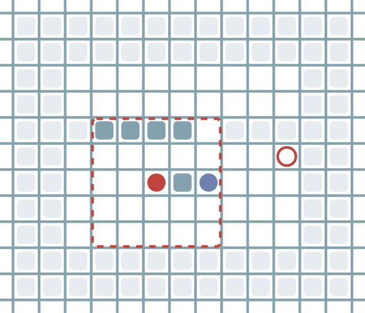

# SRSLM

**Switch and Reweight with Shared Trace for Lifelong Partially Observable
Multi-Agent Pathfinding.**

SRSLM combines AORePlan and ARPE with a learned Switcher. When AORePlan
returns wait, ARPE is used directly; otherwise, the Switcher selects a branch.

| RePlan | AORePlan |
| :---: | :---: |
|  |  |

## Install

Linux, Python 3.10 or 3.11, and a C++ compiler:

```bash
git clone https://github.com/CQSWU/SRSLM.git
cd SRSLM
uv sync
```

## Run

```bash
uv run python run_experiments.py --algorithms AORePlan
```

For SRSLM, place `EPOM-L`, `ARPE-Final-1B` and `SRSLM-Switcher-Final-1B`
in `weights/`, including their configs and checkpoints. ARPE needs only the
first two folders. Weights and experiment data are not included in this repository.

```bash
uv run python run_experiments.py --algorithms SRSLM
```

## Train

```bash
uv run python train.py --config_path learning/train_arpe_final.yaml
uv run python train_switcher.py --config_path learning/train_switcher.yaml
```

ARPE trains with 200 agents. Switcher alternates between 50, 100 and 200 agents,
resuming the same model and optimizer between stages. Settings are in the YAML files.
Training and test maps are in `maps/train.yaml` and `maps/test.yaml`.

## License

[MIT](LICENSE). AORePlan builds on RePlan, and ARPE uses EPOM as its base policy;
the original authors' notices are preserved in the license.
