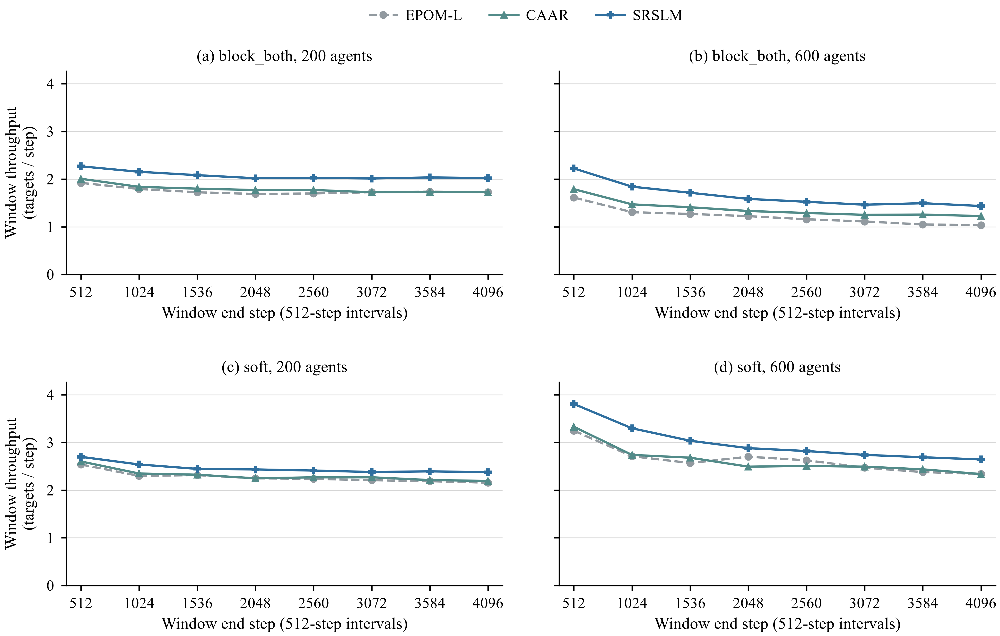

# Long-horizon evaluation

This experiment checks how throughput changes within longer lifelong episodes.
It is separate from the paper's exact960 comparison and from a controlled
runtime benchmark. All 288 episodes have completed and passed the original
collection audit. The released counts and summaries are below.

## Completed results

Mean throughput is completed goals per environment step, averaged over all
48 episodes in each method/rule arm. These are 4,096-step results, not the
separate 512-step exact960 comparison.

| Method | `block_both` | `soft` |
| --- | ---: | ---: |
| EPOM-L | 1.486099 | 2.451884 |
| CAAR | 1.586904 | 2.467250 |
| SRSLM | 1.868739 | 2.724431 |



[Vector PDF](assets/B_window_throughput_both_soft.pdf)

SRSLM has the highest overall mean under both rules. CAAR improves the
`block_both` mean, but its overall gain under `soft` is small. At 600 agents
under `soft`, CAAR and EPOM-L are nearly tied: 2.626567 and 2.630280.
All six arms have a lower last-window mean than first-window mean. The
recorded decline does not, on its own, prove that congestion caused it or
that any method eliminates congestion.

### Released data

- [Episode counts](data/long_horizon_20260908/B_episode_windows.csv): 288 rows,
  one per method/rule/map/population/seed tuple. The eight `window_*_goals`
  columns are the actual integer goal counts. `completed_targets` is their
  sum; `avg_throughput` is that sum divided by 4,096.
- [Window means by population](data/long_horizon_20260908/B_window_by_population.csv):
  the 96 points used in the figure, averaging 24 episodes per point.
- [Pooled window means](data/long_horizon_20260908/B_window_throughput.csv):
  48 points, averaging both populations equally.
- [First/last-window comparison](data/long_horizon_20260908/B_tail_comparison.csv)
  and [the same comparison by population](data/long_horizon_20260908/B_tail_by_population.csv):
  the mean changes and counts of episodes that decreased, tied or increased.
- [Provenance](data/long_horizon_20260908/PROVENANCE.json): selected model
  identities, original raw/journal/audit hashes, and hashes of these public files.

The four aggregate CSVs and the figures are unchanged copies of the accepted
outputs. The episode CSV is a field-limited export, with no runtime measurements
or machine details. Verify its complete tuple grid, integer counts, all four
aggregates and file hashes with Python's standard library:

```bash
python scripts/verify_long_horizon_release.py
```

This public check verifies the released data and arithmetic. It does not
re-run the private raw-journal, source-stability or runtime-environment audit;
the provenance hashes identify that separately retained evidence.

## Protocol

Use the same selected block-trained EPOM-L, gated CAAR and Full SRSLM weights
under both `block_both` and `soft`, with observation radius 5 and lifelong
`restart`. The planner inside SRSLM retains its conservative static-step
occupancy check under both rules.

The grid is eight maps, populations 200 and 600, and seeds 0, 42 and 123:

- `mazes-s40_wc4_od30` and `mazes-s45_wc4_od55`;
- `random-s40_d0.15` and `random-s44_d0.35`;
- `sc1-TheFrozenSea` and `sc1-Turbo`;
- `street-Shanghai_0` and `street-Sydney_0`.

Each of the six method/rule arms has 48 episodes of exactly 4,096 steps.
Across all arms this is 288 episodes. Six separate 512-step accelerator
smokes check the method/rule paths before formal evaluation; they are not
included in the reported long-horizon data.

## Window throughput

Count the actual completed goals after each environment step. Split each
episode into eight non-overlapping windows: steps 1–512, 513–1,024, and so
on through 3,585–4,096. A window's throughput is its own completed-goal count
divided by 512, not the cumulative average since the episode began.

For each method, rule and population, average the same window across its
24 map/seed episodes. Keep all eight windows and all 2,304 episode-window
records. Check that their goal counts sum to the episode's total and agree
with the original journal and validation files.

The public runner records these counts during the actual rollout in
`throughput_segments`, alongside `completed_targets_observed`. Each segment
has its start and end steps, its own completed-goal count and throughput,
and a separate cumulative throughput for cross-checking. A final segment
shorter than 512 steps uses its actual length; the protocol here has exactly
eight full segments. An old end-of-episode mean cannot recover these counts.

## Running the six arms

Use a Linux checkout with the native planner and the hash-pinned checkpoints
installed as described in [CURRENT_VERSION.md](../CURRENT_VERSION.md).
Run from the project root, leaving algorithm caching disabled. The map list
`maps/long_horizon_8.yaml` resolves the eight unchanged grids from
`maps/eval.yaml`.

```bash
common=(--map-list maps/long_horizon_8.yaml --agents 200,600
        --seeds 0,42,123 --max-steps 4096 --obs-radius 5
        --on-target restart --workers 1)

for rule in block_both soft; do
  uv run python run_experiments.py "${common[@]}" \
    --algorithms EPOM-L --collision-system "$rule" \
    --epom-weights-path weights/EPOM-lifelong-finetune-r5/EPOM-Lifelong-Finetune-R5 \
    --output-dir "results/long_horizon/epom_l_$rule" --output results.json

  uv run python run_experiments.py "${common[@]}" \
    --algorithms CAAR --collision-system "$rule" \
    --caar-candidate-manifest configs/caar_final_candidate.json \
    --output-dir "results/long_horizon/caar_$rule" --output results.json

  uv run python run_experiments.py "${common[@]}" \
    --algorithms SRSLM --collision-system "$rule" \
    --switcher-weights-path weights/SRSLM-switcher-wait-aware-caar-100m/SRSLM-WaitAware-CAAR-100M \
    --output-dir "results/long_horizon/srslm_$rule" --output results.json
done
```

Use fresh output directories and do not run a second copy of an active arm.
One worker is shown for memory safety; independent episodes can be parallelized
when the machine has enough memory. Before aggregating, require 48 unique,
error-free map/population/seed records in every arm, 4,096 decisions per record,
and all eight interval counts. Do not mix preflight episodes into these records.

The formal experiment uses its separately archived frozen source and
dependencies. This public entry point reproduces the protocol and metrics;
it is not the original source snapshot, and a new run must retain its own
source, configuration and checkpoint provenance. The historical validation
receipts must not be relabeled as validation of a new run.

## Interpretation and release boundary

The first window is not necessarily steady state. A difference between early
and late windows can include initialization, changes in the goal distribution
and traffic evolution; it does not by itself establish a congestion mechanism.
No cumulative curves, smoothing or extrapolated windows substitute for the
recorded interval counts.

These multiworker accelerator runs measure fixed-step throughput, not fair
per-decision runtime. Their elapsed time must not replace a controlled runtime
comparison. Earlier timing measurements were withheld after a hardware-load
review and are not accepted merely because old process-level checks passed.

Raw private evidence, machine paths, accelerator software, third-party code
and checkpoints are not included in this documentation release or relicensed
under the project's MIT license. See [Reproducibility](REPRODUCIBILITY.md)
for the evidence boundary and [CURRENT_VERSION.md](../CURRENT_VERSION.md)
for retained model identities.
